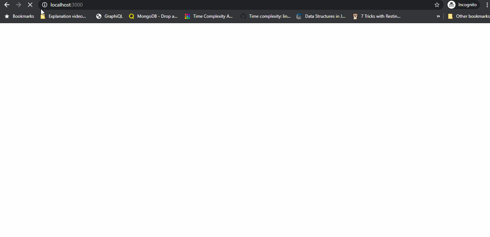
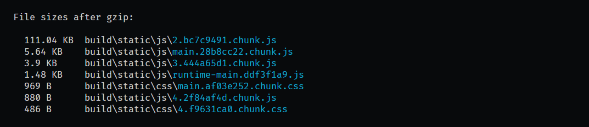

# Recipe App

A side project. Where you can add your recipe, edit your recipe and delete your recipe. It has also User Authenticate system.

	

## Server-side

* Node.js
* Express
* MongoDB/Mongoose
* Bcrypt.js, JSONWebToken
* Express Fileupload
* ESLint, Prettier

## Client-side

* React
* Context(state management)
* Material-ui
* React Testing Library
* ESLint, Prettier
* React.memo(for memoization a pure component)
* React.lazy(for lazy loading a component)

### Bundle-size(gzipped) Client

	

